# DermaAI: Microservice Architecture

โปรเจ็กต์นี้ถูกออกแบบด้วยสถาปัตยกรรมแบบ **Microservices** เพื่อแยกการทำงานแต่ละส่วนออกจากกันอย่างอิสระ ทำให้ง่ายต่อการจัดการทรัพยากร (특히 RAM บน Free Tier) และการอัปเดตระบบในอนาคต

ระบบประกอบด้วย 4 ส่วนหลัก:

---

## 🏗️ 1. Frontend Web Service (UI)

- **เครื่องมือ:** React, Vite, Vercel
- **หน้าที่:** เป็นหน้าบ้านรับรูปภาพจากผู้ใช้ และมีหน้าต่างแชทสำหรับพูดคุย
- **การเชื่อมต่อ:**
  - `VITE_MODEL_URL` → ส่งรูปไปยัง **Model Service**
  - `VITE_CHATBOT_URL` → ส่งข้อความไปยัง **Chatbot Service**

---

## 🧠 2. Model Service (Skin Analysis) - [Current Repo]

- **เครื่องมือ:** Python, Flask, ONNX Runtime, Render (Free Tier)
- **Repository:** `peerapat9375555/SE`
- **หน้าที่:** รับรูปภาพผิวหนังและทำนายความเสี่ยงของโรค
- **ทำไมต้องเป็น Microservice แยก?**
  - โมเดล PyTorch ทั่วไปกิน RAM สูง (> 600MB) ซึ่งเกินข้อจำกัดของ Render Free Tier (512MB)
  - เราจึง **แยก Service นี้ออกมา** แปลงโมเดลเป็น `.onnx` และใช้ `onnxruntime` รันบน CPU (ใช้ RAM เพียง ~80-120MB)
- **Endpoint หลัก:** `POST /api/predict` รับไฟล์รูปภาพแล้วคืนค่าผลการทำนาย (เปอร์เซ็นต์ความเสี่ยง)

---

## 🤖 3. Chatbot Service (RAG Pipeline)

- **เครื่องมือ:** Python, Flask, Supabase, Google Gemini API, KKU API Gateway, Render (Free Tier)
- **Repository:** `peerapat9375555/RAG_skin`
- **หน้าที่:**
  1. ให้บริการหน้าเพิ่มข้อมูลเข้าฐานข้อมูล (`/embed`)
  2. ตอบคำถามผู้ใช้ผ่านแชทโดยใช้เทคนิค RAG (Retrieval-Augmented Generation)
- **ทำไมต้องเป็น Microservice แยก?**
  - งานด้าน NLP (เช่น Embedding, Reranking, LLM) กิน Memory และ Compute Power สูงลิ่ว
  - หากรวมกับฝั่ง Model Service หรือใช้ Model ในเครื่อง (Local HuggingFace model) จะทำให้ OOM (Out of Memory) ทันที
  - เราจึงแยกมาอีก Service และ **เปลี่ยนไปใช้ API ทั้งหมด** เพื่อให้ RAM ไม่เกิน 100MB

### 🔄 กระบวนการ RAG Pipeline ใน Chatbot Service

เมื่อผู้ใช้พิมพ์คำถามมา 1 ประโยค ระบบทำงานตามลำดับนี้:

1. **Embedding (Google Gemini):**
   - รับคำถามผู้ใช้ ไปแปลงเป็นเวกเตอร์ (768 มิติ) ผ่าน `text-embedding-004`
   - _ใช้คีย์: `EMBED_API_KEY` (Google AI Studio)_

2. **Vector Retrieval (Supabase pgvector):**
   - นำเวกเตอร์ไปค้นหาเอกสารที่มีความหมายใกล้เคียงที่สุดใน Supabase
   - ดึงข้อมูลเบื้องต้นมา **8 เอกสาร (Candidate)**

3. **Reranking (KKU LLM):**
   - ส่ง 8 เอกสาร พร้อมคำถาม ไปให้ LLM (Gemini) ช่วย **ให้คะแนน (Score)** ความเกี่ยวข้อง
   - คัดกรองและเลือกเฉพาพ **4 เอกสารที่ตอบตรงคำถามที่สุด**
   - _ใช้คีย์: `RERANK_API_KEY` (KKU Gateway)_

4. **Generation (KKU LLM):**
   - นำ 4 เอกสารสุดท้าย ป้อนเป็น `Context` (ข้อมูลอ้างอิง) ให้ LLM อ่าน
   - สั่งให้ LLM คัดลอก/สรุปเนื้อหาจาก Context เพื่อตอบคำถามผู้ใช้
   - _ใช้คีย์: `LLM_API_KEY` (KKU Gateway)_

- **Endpoint หลัก:** `POST /api/chat` , `POST /api/embed`

---

## 🗄️ 4. Vector Database

- **เครื่องมือ:** Supabase (PostgreSQL + `pgvector` extension)
- **หน้าที่:**
  - เก็บข้อมูลเอกสารด้านโรคผิวหนังในรูปแบบเวกเตอร์ 768 มิติ (สร้างจาก Google Gemini Embedding)
  - มีฟังก์ชัน RPC `match_skin_documents` สำหรับทำ Cosine Similarity Search ที่รวดเร็ว

---

## 🔗 ภาพรวมการไหลของข้อมูล (Data Flow)

```mermaid
%%{init: {'theme': 'dark', 'themeVariables': { 'primaryColor': '#1e1e1e', 'edgeLabelBackground':'#121212', 'lineColor': '#8b949e', 'textColor': '#c9d1d9'}}}%%
graph LR

    %% ----------------------------------------------------
    %% User Layer
    %% ----------------------------------------------------
    subgraph UserSpace ["👥 User Space"]
        User(("👤 User\n(Mobile / Web)"))
    end

    %% ----------------------------------------------------
    %% Frontend (Vercel)
    %% ----------------------------------------------------
    subgraph Vercel ["⚡ Frontend Layer (Vercel)"]
        UI["💻 React Vite App\n(dermaai.vercel.app)"]
    end

    %% ----------------------------------------------------
    %% Backend (Render)
    %% ----------------------------------------------------
    subgraph Render ["☁️ Backend Layer (Render Microservices)"]

        %% Service 1: Model
        subgraph ModelService ["🧠 Model Service"]
            API_Predict["Predict API\n/api/predict"]
            ONNX("⚙️ ONNX Runtime\nCPU Inference")
            API_Predict --> ONNX
        end

        %% Service 2: Chatbot (RAG)
        subgraph ChatbotService ["🤖 Chatbot / RAG Service"]
            API_Chat["Chat API\n/api/chat"]

            EmbedProcess["1️⃣ Embed Query"]
            SearchProcess["2️⃣ Vector Retrieval"]
            RerankProcess["3️⃣ LLM Reranking"]
            GenProcess["4️⃣ Generation"]

            API_Chat --> EmbedProcess
            EmbedProcess --> SearchProcess
            SearchProcess --> RerankProcess
            RerankProcess --> GenProcess
        end
    end

    %% ----------------------------------------------------
    %% External Services
    %% ----------------------------------------------------
    subgraph External ["🌐 External APIs & Storage"]

        SupaDB[("🗄️ Supabase\nVector DB")]

        subgraph GoogleAPI ["🔹 Google AI"]
            GeminiEmbed(("text-embedding-004"))
        end

        subgraph KKUAPI ["🔹 KKU Gateway"]
            KKURerank(("Gemini (Key 2)\nfor Reranking"))
            KKUGen(("Gemini (Key 1)\nfor Chat LLM"))
        end
    end

    %% ----------------------------------------------------
    %% Workflow Connections
    %% ----------------------------------------------------

    User == "Uses" ==> UI

    %% Front to Back
    UI -- "Upload Image" --> API_Predict
    UI -- "Chat Message" --> API_Chat

    %% Model return
    ONNX -. "Return Risk %" .-> UI

    %% RAG Pipeline Flow
    EmbedProcess -- "[EMBED_API_KEY]" --> GeminiEmbed
    GeminiEmbed -. "768-dim Vector" .-> SearchProcess

    SearchProcess -- "Cosine Similarity" --> SupaDB
    SupaDB -. "Top 8 Docs" .-> RerankProcess

    RerankProcess -- "[RERANK_API_KEY]" --> KKURerank
    KKURerank -. "Top 4 Docs" .-> GenProcess

    GenProcess -- "[LLM_API_KEY]" --> KKUGen
    KKUGen -. "Final Answer" .-> API_Chat

    %% Final
    API_Chat -. "Display Text" .-> UI

    %% ----------------------------------------------------
    %% Styling (Dark Mode Optimized)
    %% ----------------------------------------------------
    classDef frontend fill:#0d1117,stroke:#58a6ff,stroke-width:2px,color:#c9d1d9;
    classDef model fill:#0d1117,stroke:#3fb950,stroke-width:2px,color:#c9d1d9;
    classDef chatbot fill:#0d1117,stroke:#a371f7,stroke-width:2px,color:#c9d1d9;
    classDef db fill:#0d1117,stroke:#d29922,stroke-width:2px,color:#c9d1d9;
    classDef process fill:#21262d,stroke:#8b949e,stroke-width:1px,color:#c9d1d9,rx:5px,ry:5px;
    classDef api fill:#0d1117,stroke:#f85149,stroke-width:2px,color:#c9d1d9;

    class UI frontend;
    class API_Predict,ONNX model;
    class API_Chat chatbot;
    class EmbedProcess,SearchProcess,RerankProcess,GenProcess process;
    class GeminiEmbed,KKURerank,KKUGen api;
    class SupaDB db;
```

---

## 🚀 ข้อดีของสถาปัตยกรรมนี้

1. **แก้ปัญหา RAM บน Free Tier อย่างสมบูรณ์:** ไม่มีการโหลด Model ใดๆ เข้า Memory (ทั้งฝั่ง Computer Vision และ Natural Language) เพราะใช้ ONNX และ External APIs แทน
2. **แม่นยำด้วยการทำ Reranking:** การใช้ LLM มาช่วยวิเคราะห์เอกสารแบบ Re-rank ก่อนจัดเรียง ทำให้ได้ Context ที่เกี่ยวข้องจริงๆ ตัดปัญหาดึงข้อมูลผิดพลาด
3. **ลดค่าใช้จ่ายรัน Server:** เพราะสามารถใช้ระดับ Free Tier ของแพลตฟอร์มต่างๆ รวมกันจนเป็นระบบใหญ่ได้ (Vercel = Host Web, 2x Render = Host 2 APIs, Supabase = DB)
